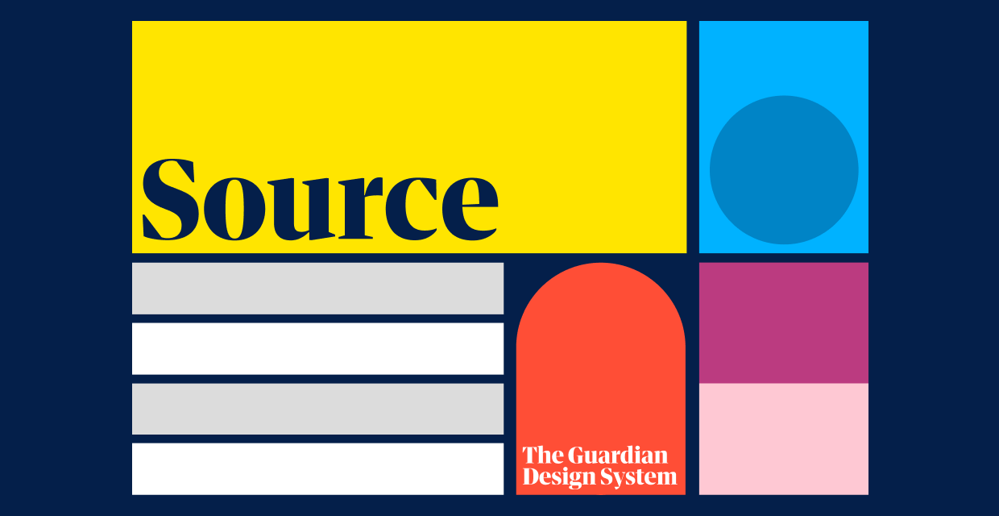

> A component library for the Guardian's [Source Design System](https://theguardian.design).

## Source packages ⚛️

There are two main Source packages:

- [`@guardian/source`](../../libs/@guardian/source/README.md): Contains `foundations` (the atoms from which all our visual design is built and which may be used with any CSS-in-JS library), and `react-components` (a set of robust, accessible React components built using `foundations`).
- [`@guardian/source-development-kitchen`](../../libs/@guardian/source-development-kitchen/README.md): The Development Kitchen is where new components and patterns can be cooked up, tested and shared. There are minimal acceptance criteria. It’s okay to duplicate and break things. If a Kitchen component proves valuable, it may be promoted to `@guardian/source`

## Contributing

We welcome contributions to Source! See our [contributing](contributing.md) and [Storybook](storybook.md) docs for more info.
