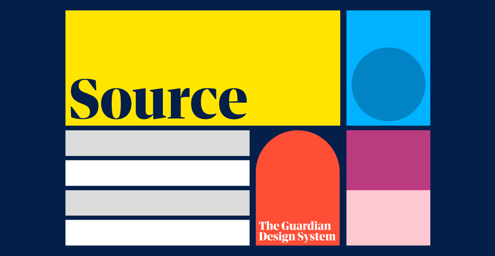

# `@guardian/source`



> An NPM package containing design foundations and robust, accessible React components from the Guardian's
> [Source Design System](https://theguardian.design).

[](https://www.npmjs.com/package/@guardian/source)
<a href="https://guardian.github.io/storybooks" target="_blank"></a>

## Install

```sh
$ pnpm add @guardian/source
```

or

```sh
$ yarn add @guardian/source
```

or

```sh
$ npm install @guardian/source
```

> [!NOTE]
> Use of the React components will require [@emotion/react](https://emotion.sh/docs/introduction#react)

## Documentation

Full documentation is available in the [Source storybook](https://guardian.github.io/storybooks).

## Contributing

We welcome contributions to Source! See our [contributing](../../../docs/source/contributing.md) and [Storybook](../../../docs/source/storybook.md) docs for more info.
